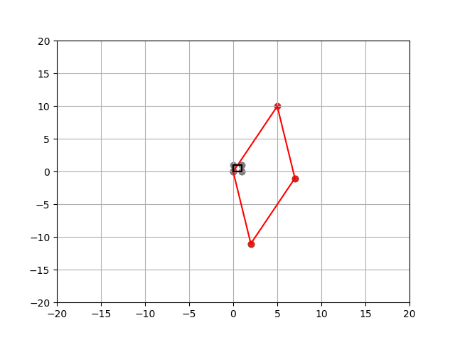
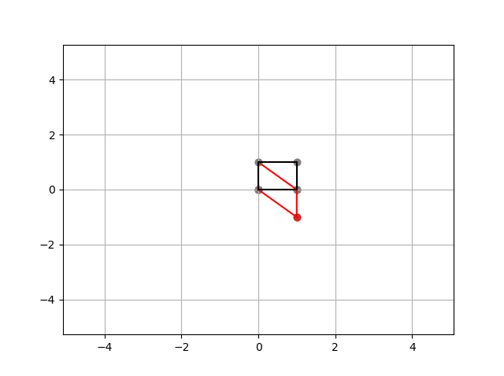
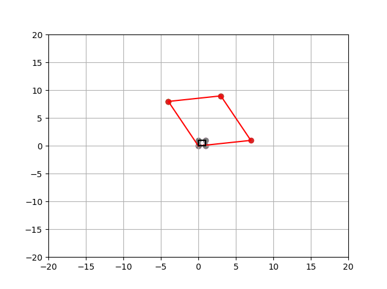

Examples:


```
  2, 5,  0
-11, 10, 0
  0, 0,  1
  
```

```
rotate by:  0.9272952180016124
scale by  5.0  to  7 x -1 y = 0
scale by  15.0  to  -3 x -21 y = 0
```



```
 1, 0, 0
-1, 1, 0
 0, 0, 1
```

```	  
rotate by:  0.46364760900080615
scale by  0.6180339887498949  to  1 x +0.618034 y = 0
scale by  1.618033988749895  to  1.618034 x -2.618034 y = 0
```



```
-4, 7, 0
 8, 1, 0
 0, 0, 1
```
 
```
rotate by 0.3217505543966423
scale by  6.324555320336758  to  10 x +10 y = 0
scale by  9.486832980505138  to  -15 x +15 y = 0
```


