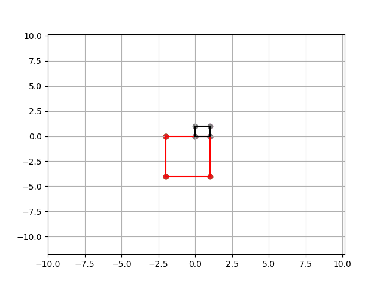
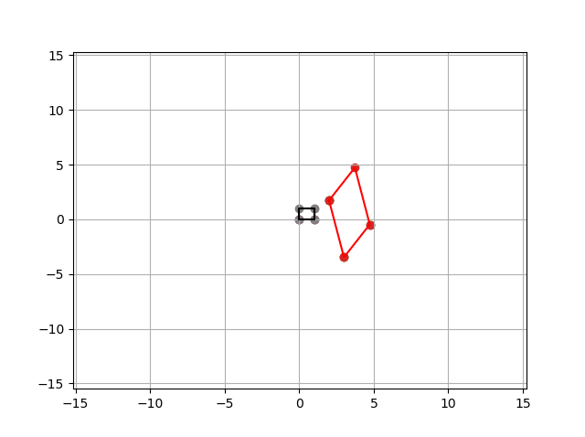

# Examples:


```
  2, 5,  0
-11, 10, 0
  0, 0,  1
```

```
rotate around (0 0) by 0.9273
scale by 5 to 7x -1y  = 0
scale by 15 to -3x -21y  = 0
```


```
 1, 0, 0
-1, 1, 0
 0, 0, 1
```

```	  
rotate around (0 0) by 0.46365
scale by 0.61803 to 1x +0.61803y  = 0
scale by 1.61803 to 1.61803x -2.61803y  = 0
```


```
-4, 7, 0
 8, 1, 0
 0, 0, 1
```
 
```
rotate around (0 0) by 0.32175
scale by 6.32456 to 10x +10y  = 0
scale by 9.48683 to -15x +15y  = 0
```


```
0, 3, -2
-4, 0, 0
0, 0, 1
```

```
rotate around (-0.15385 0.61538) by -1.5708
scale by 4 to  -4y -0.15385 = 0
scale by 3 to -3x  +0.61538 = 0
```




```
1, sqrt(3), 2
-3*sqrt(3), 3, sqrt(3)
0, 0, 1
```

```
rotate around (-0.11111 -1.1547) by -1.0472
scale by 2 to 4x  -0.11111 = 0
scale by 6 to  -12y -1.1547 = 0
```


